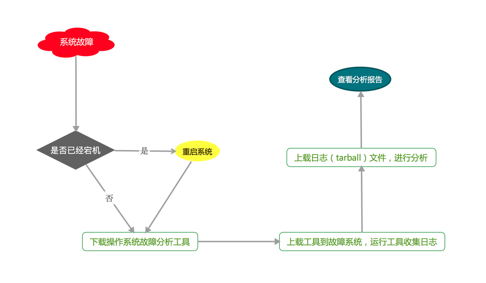

# 扁鹊项目架构

>**Author**: weizhanbiao

>**Date**: 2018/1/10

>[TOC]

## 一.应用场景

>###需求：

>>1.提供下载工具功能

>>2.提供上传日志文件包功能

>>3.提供日志分析，产出报告功能

## 二.应用系统划分：
>#### 1.aliyun(阿里云数据表)
>>展示数据库数据；

>#### 2.report(报表图)
>>根据 健康值、健康值范围、检查项、主机数 统计形成报表图，及其展示；

>#### 3.query(查询)
>>根据 <云类型><版本号><项目名称><检查项><收集时间> 查询符合条件的主机，并展示主机列表；

>#### 4.check(辅助功能)
>>提供 上传（项目包或者单个主机包）、下载主机包、下载系统脚本工具 功能；

>!!! warning "解耦设计"
    这里利用可高度扩展的不相互影响业务的流程架构（解耦），目标清晰;
    具体实现将在各应用中具体介绍。

>## 三.架构逻辑：

>>通过前端web页面，可上传单个主机收集日志包和整个项目的日志收集包、下载原始日志收集包、展示收集及其check主机数据、各项分析报表、查询主机等功能。

